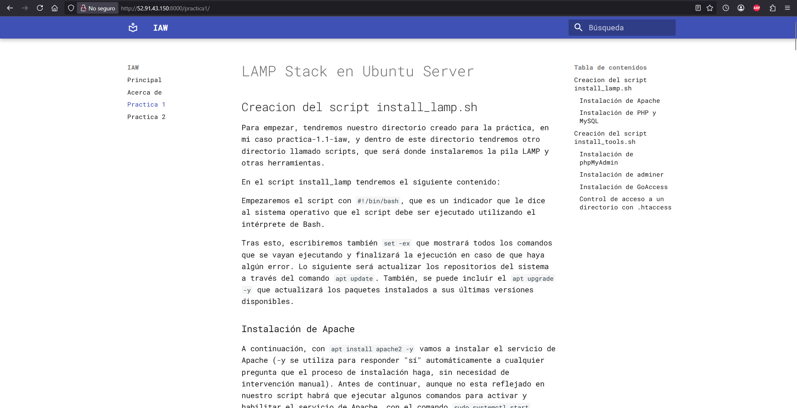

# Creación de un sitio web estático con MkDocs y GitHub Pages

Dentro del directorio de nuestro proyecto deberemos crear el archivo de configuración YAML mkdocs.yml. Por ejemplo, en mi archivo de configuración mkdocs.yml estamos indicando el nombre del sitio web que voy a crear (site_name), los enlaces a las páginas que van a aparecer en el menú de navegación (nav) y el tema que se va a utilizar (theme). Además se han añadido las siguientes opciones:

- He cambiado la fuente de la letra a Roboto Mono (``font: text: Roboto Mono``).
- He cambiado el idioma a español (``language: es``).
- Se ha cambiado el icono (``icon: logo: material/library-outline``).
- Se ha añadido una característica que hace que la cabecera se oculte al bajar por la página (``features: - header.autohide``)

En nuestro directorio docs tendremos el apartado de about.md, index.md y las practicas que he añadido con sus imágenes.

