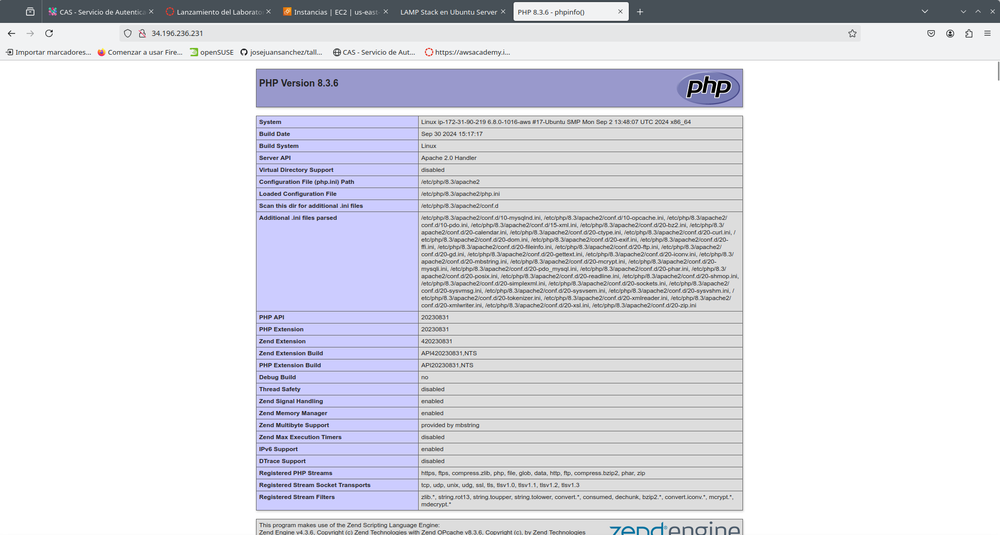
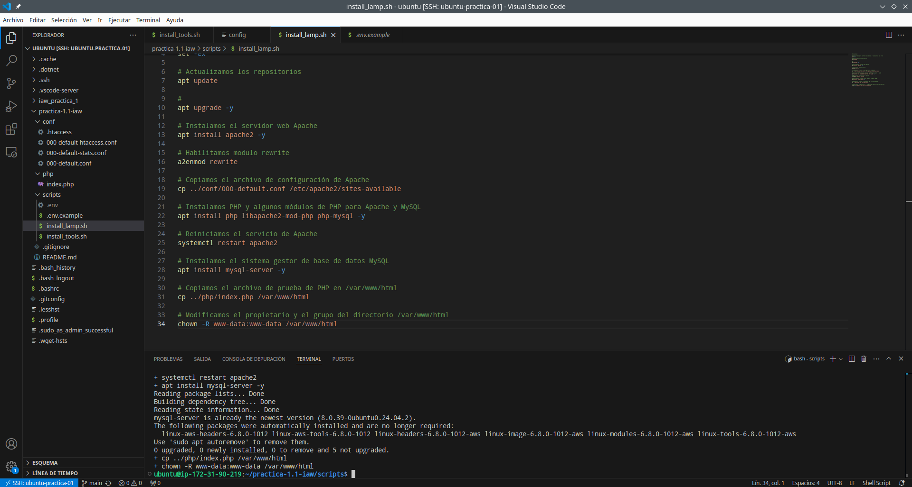
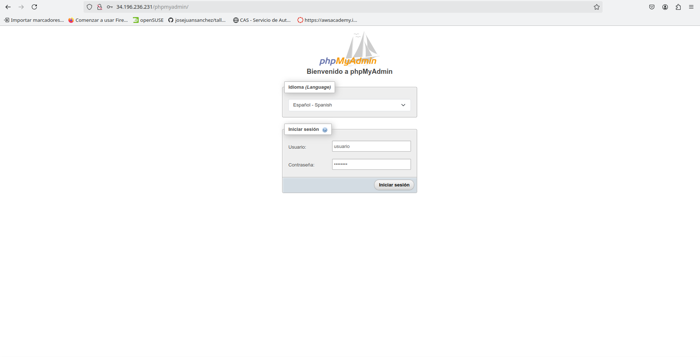
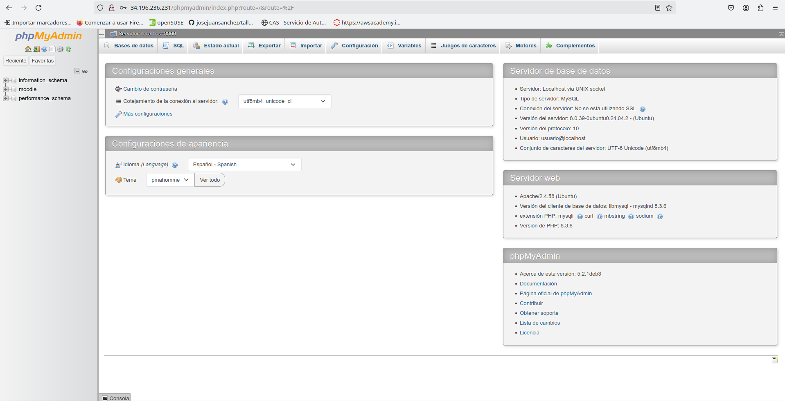
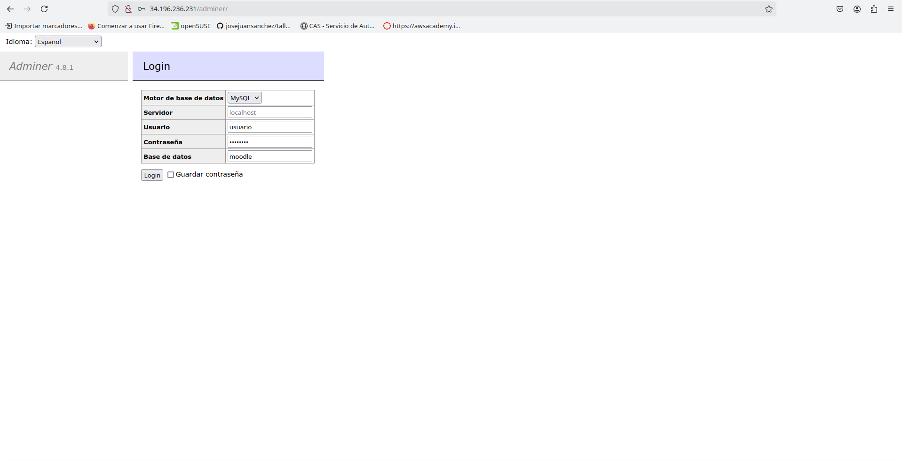
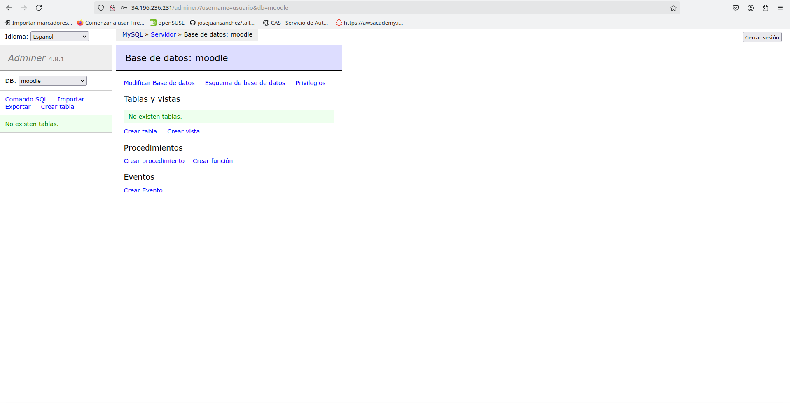
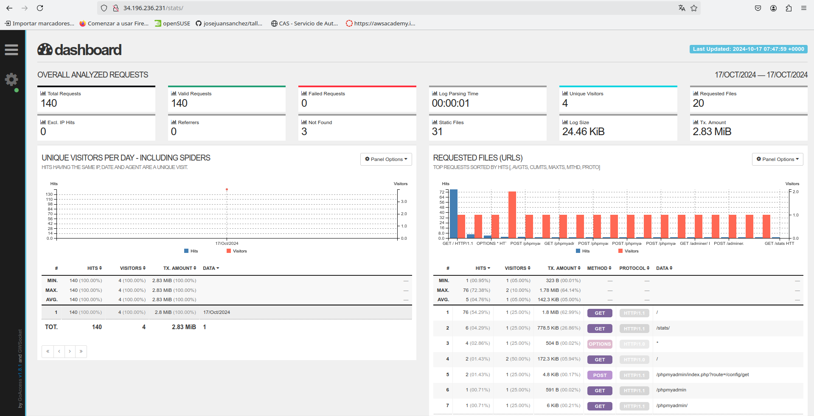
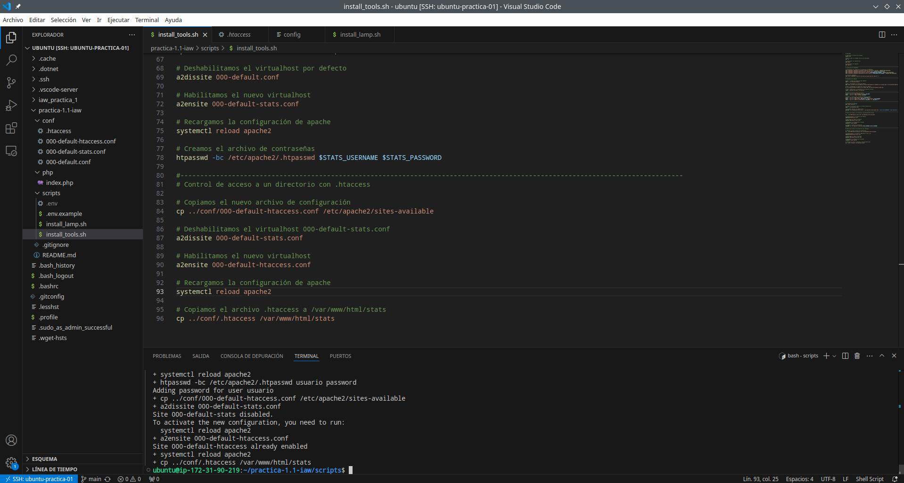

# LAMP Stack en Ubuntu Server

## Creacion del script install_lamp.sh
Para empezar, tendremos nuestro directorio creado para la práctica, en mi caso practica-1.1-iaw, y dentro de este directorio tendremos otro directorio llamado scripts, que será donde instalaremos la pila LAMP y otras herramientas.

En el script install_lamp tendremos el siguiente contenido:

Empezaremos el script con `#!/bin/bash`, que es un indicador que le dice al sistema operativo que el script debe ser ejecutado utilizando el intérprete de Bash.

Tras esto, escribiremos también ``set -ex`` que mostrará todos los comandos que se vayan ejecutando y finalizará la ejecución en caso de que haya algún error. Lo siguiente será actualizar los repositorios del sistema a través del comando ``apt update``. También, se puede incluir el ``apt upgrade -y`` que actualizará los paquetes instalados a sus últimas versiones disponibles.

### Instalación de Apache
A continuación, con ``apt install apache2 -y`` vamos a instalar el servicio de Apache (-y se utiliza para responder "sí" automáticamente a cualquier pregunta que el proceso de instalación haga, sin necesidad de intervención manual). Antes de continuar, aunque no esta reflejado en nuestro script habrá que ejecutar algunos comandos para activar y habilitar el servicio de Apache, con el comando ``sudo systemctl start apache2`` iniciamos el servicio y ``sudo systemctl enable apache2`` dejará activado el servidor y no se apagará cada vez que apaguemos la máquina.

Lo proximo a realizar será habilitar el modulo rewrite (`a2enmod rewrite`), este módulo es muy útil porque permite la reescritura de URLs, lo que es importante para muchas aplicaciones web (como las que usan URLs limpias o amigables con SEO).

Fuera de nuestro directorio scripts, tendremos un directorio llamado *conf* donde tendremos varios archivos de configuración, en este caso vamos a hablar del archivo **000-default.conf**, lo que vamos a hacer es cambiar el archivo de configuración por defecto de Apache con este archivo que tiene el siguiente contenido:
```
<VirtualHost *:80>
    #ServerName www.example.com
    ServerAdmin webmaster@localhost
    DocumentRoot /var/www/html/

    DirectoryIndex index.php index.html

    ErrorLog ${APACHE_LOG_DIR}/error.log
    CustomLog ${APACHE_LOG_DIR}/access.log combined
</VirtualHost>
```
La directiva DirectoryIndex se utiliza para configurar el orden prioridad de los archivos que se van a mostrar cuando se accede a un directorio. En este caso, se dará prioridad al index.php. Una vez creado este archivo de configuración, en nuestro script vamos a hacer un ``cp ../conf/000-default.conf /etc/apache2/sites-available`` para copiar el archivo de configuración de Apache.

### Instalación de PHP y MySQL

Para que un servidor web Apache pueda procesar código PHP vamos a necesitar instalar el intérprete de PHP y algunos módulos adicionales. En nuestro añadiremos el siguiente comando ``apt install php libapache2-mod-php php-mysql -y``. ``php`` es el intérprete de PHP, ``libapache2-mod-php`` permite servir páginas PHP desde el servidor web apache y ``php-mysql`` permite conectar a una base de datos MySQL desde código PHP. Será necesario reiniciar el servicio de Apache para que se apliquen los cambios ``sudo systemctl restart apache2``.

Lo siguiente será la instalación de MySQL Server ``apt install mysql-server -y``, al igual que en Apache utilizaremos en el terminal ``sudo systemctl start mysql`` y ``sudo systemctl enable mysql`` para iniciar y habilitar el servicio de MySQL respectivamente. Con MySQL instalado podremos acceder a los archivos de configuración en */etc/mysql/mysql.cnf*, a los archivos de log en */var/log/mysql/error.* y podremos acceder a MySQL con ``sudo mysql``.

Ya instalado el servicio de MySQL, volveremos a PHP y ahora vamos a tener un directorio llamado *php* donde tendremos un archivo llamado *info.php* que nos va a servir para comprobar que la instalación se ha realizado correctamente. Su estructura será:

```php
<?php

phpinfo();

?>
```
En nuestro script vamos a copiar el archivo de prueba de PHP en /var/www/html ``cp ../php/index.php /var/www/html``. Una vez que ejecutemos nuestro script, si accedemos a nuestra dirección IP podremos comprobar que aparece la información de php.



Lo último que vamos a hacer en este script será modificar el propietario y el grupo del directorio /var/www/html de forma recursiva, para que el usuario y grupo www-data puedan acceder a él ``chown -R www-data:www-data /var/www/html``. Este es el usuario con el que se ejecuta el servicio Apache. Una vez finalizado el script lo ejecutaremos en el terminal con ``sudo ./install_lamp.sh`` y comprobaremos que se ejecuta todo correctamente.



## Creación del script install_tools.sh
En este script, para empezar, vamos a copiar las 10 primeras líneas del anterior script. También, en nuestro directorio scripts vamos a tener el archivo .env que guarda las variables que serán necesarias más adelante para las distintas bases de datos y demás. Vamos a importar este archivo y lo haremos con ``source .env``, en los archivos de está práctica no se ve el .env porque los hemos añadido en el archivo *.gitignore* para que no se puedan ver la información privada de ese archivo, en cambio, tenemos el *.env.example* que tendra el nombre de las variables pero no la información.

### Instalación de phpMyAdmin

Vamos a instalar phpMyAdmin, pero primero vamos a configurar una serie de respuestas que se hacen al instalar phpMyAdmin, en nuestro caso las vamos a automatizar. Para ello, en nuestro script añadiremos el siguiente contenido:

```
echo "phpmyadmin phpmyadmin/reconfigure-webserver multiselect apache2" | debconf-set-selections
echo "phpmyadmin phpmyadmin/dbconfig-install boolean true" | debconf-set-selections
echo "phpmyadmin phpmyadmin/mysql/app-pass password $PHPMYADMIN_APP_PASSWORD" | debconf-set-selections
echo "phpmyadmin phpmyadmin/app-password-confirm password $PHPMYADMIN_APP_PASSWORD" | debconf-set-selections
```

Por orden, estas respuestas serán para seleccionar el servidor web que queremos configurar para ejecutar, confirmar que desea utilizar dbconfig-common para configurar la base de datos y seleccionar la contraseña para phpMyAdmin.

Una vez se automatize esto, procederemos a la instalación de phpMyAdmin ``apt install phpmyadmin php-mbstring php-zip php-gd php-json php-curl -y``. La instalación también contiene una serie de paquetes que sirven para:

- php-mbstring: Incluye el módulo mbstring (multi-byte string) que permite administrar cadenas no-ASCII y convertir cadenas a diferentes codificaciones.
- php-zip: Permite la carga de archivos .zip a phpMyAdmin.
- php-gd: Incluye la librería GD Graphics que permite crear y modificar imágenes.
- php-json: Añade soporte para trabajar con el formato JSON desde PHP.
- php-curl: Permite interactuar con servidores haciendo uso de diferentes protocolos desde PHP.

A través de nuestra IP podremos acceder a phpmyadmin aunque todavía no tendremos creada ninguna base de datos ni usuario.



### Instalación de adminer

Adminer es una alternativa a phpMyAdmin. Tiene la ventaja que se distribuye en un único archivo .php.

El primer paso será crear un directorio para adminer en /var/www/html, en nuestro script añadiremos ``mkdir -p /var/www/html/adminer``, lo siguiente será descargar el archivo de adminer con la utilidad *wget* ``wget https://github.com/vrana/adminer/releases/download/v4.8.1/adminer-4.8.1-mysql.php -P /var/www/html/adminer``, con -P se indica la ruta donde se guardará el archivo, en este caso, en el directorio adminer que hemos creado anteriormente. También, vamos a renombrar el nombre del archivo por index.php para que se muestre, utilizaremos el comando ``mv /var/www/html/adminer/adminer-4.8.1-mysql.php /var/www/html/adminer/index.php``. Para terminar con adminer, modificaremos el propietario y el grupo del archivo como ya hemos en el script anterior ``chown -R www-data:www-data /var/www/html``.

Vamos a crear una base de datos de ejemplo:
```
mysql -u root <<< "DROP DATABASE IF EXISTS $DB_NAME"
mysql -u root <<< "CREATE DATABASE $DB_NAME"
```
Y también un usuario para la base da datos creada:
```
mysql -u root <<< "DROP USER IF EXISTS '$DB_USER'@'%'"
mysql -u root <<< "CREATE USER '$DB_USER'@'%' IDENTIFIED BY '$DB_PASSWORD'"
mysql -u root <<< "GRANT ALL PRIVILEGES ON $DB_NAME.* TO '$DB_USER'@'%'"
```
Se van a usar las variables configuradas en el archivo *.env*. La creación de esta base de datos va a servir para poder acceder con un usuario y una contraseña a las herramientas que hemos instalado previamente. Por ejemplo, ya podemos acceder a la base de datos en phpMyAdmin.



Para acceder a Adminer, habrá que acceder con nuestra IP/adminer y podremos introducir el usuario, la contraseña y la base de datos que vamos a utilizar.




### Instalación de GoAccess
La siguiente herramienta a instalar será un analizador de logs para Apache Server llamado GoAccess. Para su instalación, habrá que incluir en nuestro script *install_tools.sh* el comando ``apt install goaccess -y``. Una vez que hemos instalado la utilidad podemos usarla para procesar los archivos de log access.log de Apache HTTP Server. Queremos tener en nuestro script un comando que parsea el archivo de log access.log y genera un archivo HTML en tiempo real. Pero antes de añadir este comando se va a crear un directorio llamado stats dentro del directorio /var/www/html donde se podrán consultar los informes generados con goaccess. El acceso a este directorio va a estar controlado y solo se podrá acceder mediante un usuario y una contraseña. En nuestro script añadimos ``mkdir -p /var/www/html/stats`` para crear el directorio *stats* y ejecutamos GoAccess en segundo plano ``goaccess /var/log/apache2/access.log -o /var/www/html/stats/index.html --log-format=COMBINED --real-time-html --daemonize`` que hará lo que ya he comentado anteriormente y para generar el archivo HTML en tiempo real es necesario abrir el puerto 7890 en el firewall de nuestra instancia.

A continuación, vamos a realizar el control de acceso a un directorio con autenticación básica. Para ello, en nuestro directorio *conf* vamos a tener otro archivo de configuración pero en este caso para el directorio *stats*, *000-default-stats* que contiene:

```
<VirtualHost *:80>
        #ServerName www.example.com
        ServerAdmin webmaster@localhost
        DocumentRoot /var/www/html

        DirectoryIndex index.php index.html

        <Directory "/var/www/html/stats">
          AuthType Basic
          AuthName "Acceso restringido"
          AuthBasicProvider file
          AuthUserFile "/etc/apache2/.htpasswd"
          Require valid-user
        </Directory>

        ErrorLog ${APACHE_LOG_DIR}/error.log
        CustomLog ${APACHE_LOG_DIR}/access.log combined
</VirtualHost>
```
Como podemos ver tiene una parte parecida al anterior archivo de configuración con DirectoryIndex dando prioridad al index.php, pero se añade lo siguiente para el directorio *stats*:
- AuthType Basic: Esta directiva indica que se va a utilizar el tipo de autenticación más básico.
- AuthName: Esta directiva nos permite condigurar la cadena de texto que le aparecerá al usuario en el cuadro de diálogo.
- AuthBasicProvider file: En este caso es opcional, porque la opción file es el valor por defecto para esta directiva.
- AuthUserFile: Indica la ruta donde se encuentra el archivo de contraseñas que vamos a generar en nuestro script.
- Require valid-user: Esta directiva nos permite indicar el proveedor de autenticación que vamos a utilizar. La opción Require valid-user permite el acceso a cualquier usuario que aparezca en el archivo de contraseñas.

Volvemos a nuestro script, y lo primero va a ser copiar el archivo de configuración recién creado, ``cp ../conf/000-default-stats.conf /etc/apache2/sites-available``. Deshabilitamos el virtualhost que teníamos antes ``a2dissite 000-default.conf`` y habilitamos el nuevo archivo ``a2ensite 000-default-stats.conf``, recargamos la configuración de apache para que se apliquen los cambios ``systemctl reload apache2``. Como hemos visto en el archivo de configuración se hacía referencia a */etc/apache2/.htpasswd*, este archivo contiene las contraseñas para el usuario que accederá al directorio *stats*, añadimos a nuestro script el siguiente comando ``htpasswd -bc /etc/apache2/.htpasswd $STATS_USERNAME $STATS_PASSWORD``, la opción -b sirve para poder indicarle el nombre del usuario y la contraseña como parámetros y las variables son las configuradas en el archivo *.env*

### Control de acceso a un directorio con .htaccess

Los archivos .htaccess permiten realizar cambios en la configuración del servidor web Apache sin tener que modificar los archivos principales de configuración. Los archivos .htaccess contienen las directivas de configuración que queremos aplicar sobre un directorio específico y todos sus subdirectorios. Vamos a tener un nuevo archivo de configuración *000-default-htaccess.conf* con el contenido:

```
<VirtualHost *:80>
  #ServerName www.example.com
  ServerAdmin webmaster@localhost
  DocumentRoot /var/www/html

  DirectoryIndex index.php index.html

  <Directory "/var/www/html/stats">
    AllowOverride All
  </Directory>

  ErrorLog ${APACHE_LOG_DIR}/error.log
  CustomLog ${APACHE_LOG_DIR}/access.log combined
</VirtualHost>
```
Con la directiva **AllowOverride All** en la configuración de Apache controla qué directivas de configuración se pueden sobrescribir mediante un archivo .htaccess. Cuando estableces AllowOverride All, le estás diciendo a Apache que permita que todas las directivas configurables en un archivo .htaccess anulen las configuraciones del servidor principal.

En nuestro script vamos a copiar el archivo de configuración ``cp ../conf/000-default-htaccess.conf /etc/apache2/sites-available``. Deshabilitamos el archivo de configuración de stats ``a2dissite 000-default-stats.conf`` y habilitamos el de htaccess ``a2ensite 000-default-htaccess.conf``, recargamos la configuración de Apache ``systemctl reload apache2``. Por último, vamos a tener un archivo en *conf* llamado *.htaccess* que contiene:

```
AuthType Basic
AuthName "Acceso restringido"
AuthBasicProvider file
AuthUserFile "/etc/apache2/.htpasswd"
Require valid-user
```

Vamos a copiar el *.htaccess* dentro del directorio que queremos proteger con usuario y contraseña, que será /var/www/html/stats ``cp ../conf/.htaccess /var/www/html/stats``. Ya terminado el script, vamos a lanzarlo con ``sudo ./install_tools.sh`` y comprobaremos que funciona correctamente. Accederemos a nuestra IP/stats para comprobar si funciona en tiempo real.



