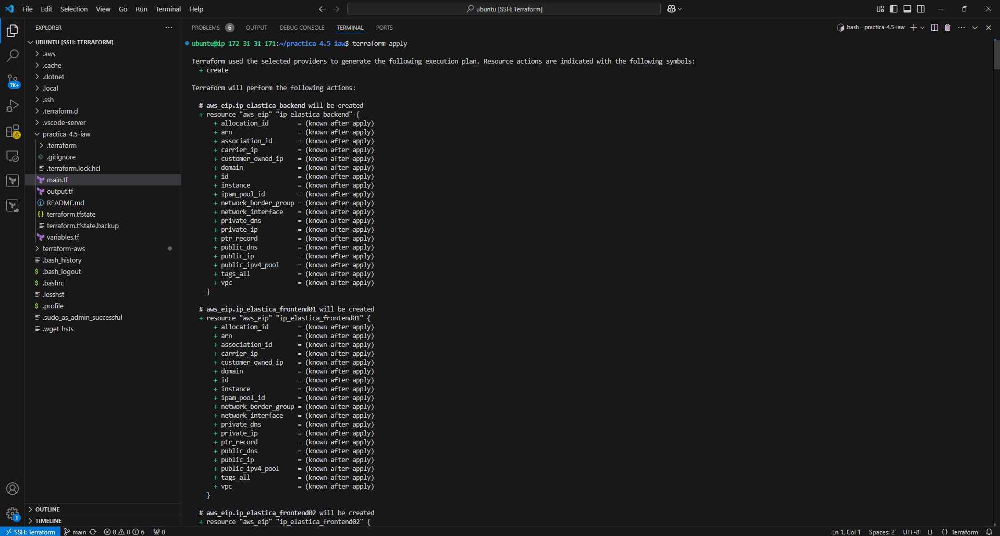
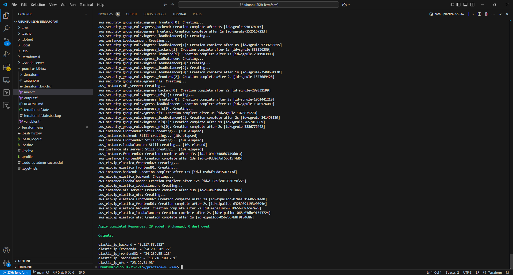
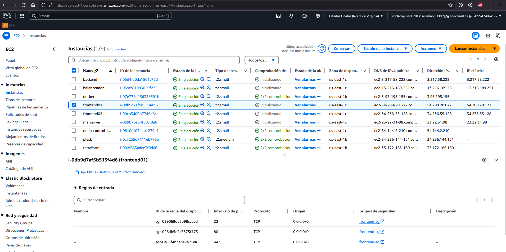
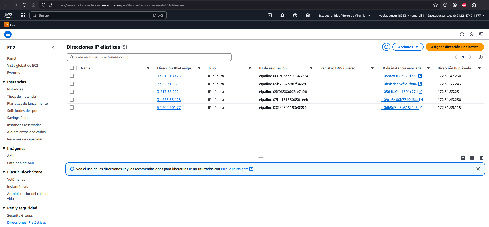
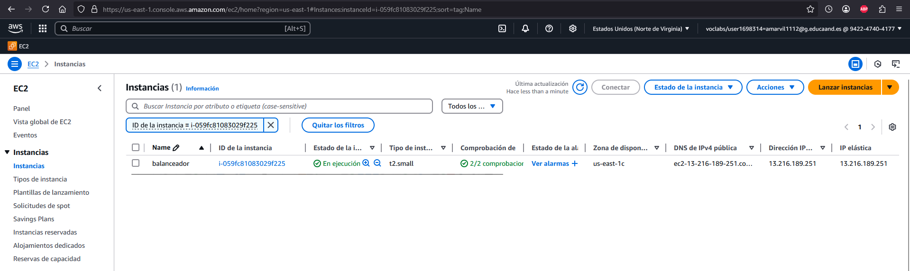
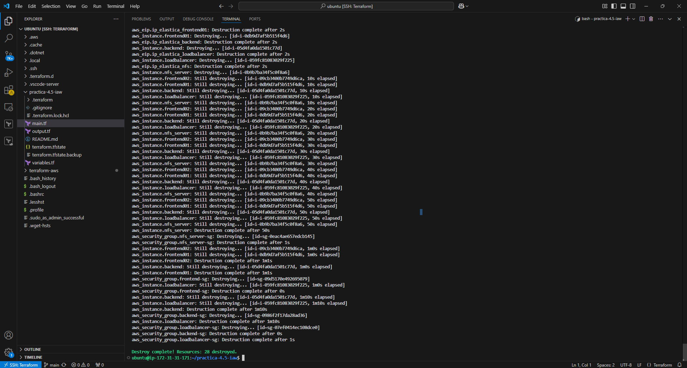
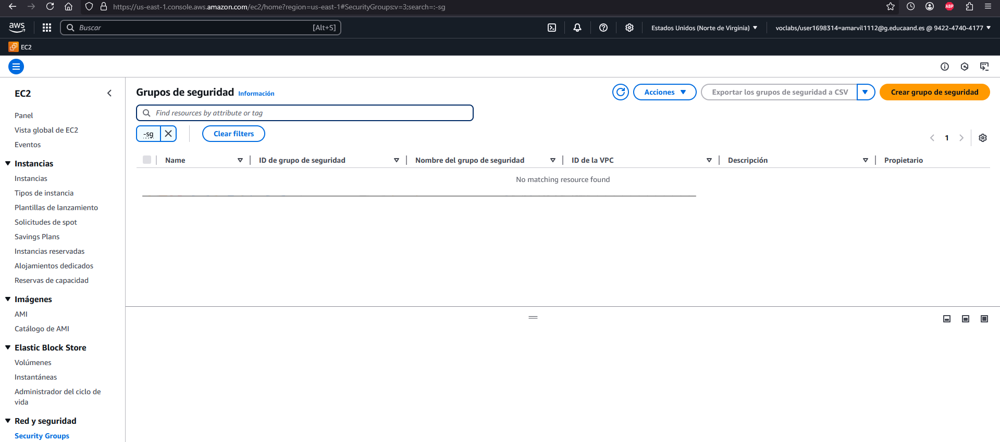
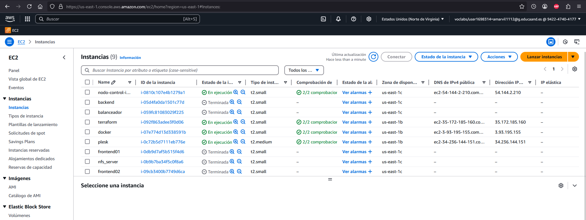

# Terraform para Practica 1.11

Para esta práctica vamos a utilizar Terraform, una herramienta de infraestructura como código que permite crear, modificar y eliminar infraestructura de forma automática.Puede gestionar los recursos de diferentes proveedores de servicios en la nube, como AWS.

Antes de ejecutar la práctica, vamos a necesitar la instalación del plugin HashiCorp Terraform. Una vez instalado, dentro de nuestro repositorio ejecutaremos en la terminal ``terraform init`` para descargar los plugins necesarios del proveedor que se especifica en el archivo de configuración.

Vamos a tener 3 scripts, en el variables se definiran las variables que se utilizarán en el script **main.tf**. En main.tf crearemos los grupos de seguridad, las instancias e IPs elásticas necesarias para crear la infraestructura de la práctica 1.11. En output.tf mostraremos las IPs públicas de las instancias.

Para la creación de esta infraestructura ejecutaremos en la terminal ``terraform apply`` para aplicar los cambios y crear los recursos del archivo de configuración en nuestra cuenta de AWS.

Una vez que termine la ejecución del comando iremos a AWS a comprobar que se han creado los grupos de seguridad, las IPs elásticas y las instancias que tendrán que tener asociados su grupo de seguridad correspondiente y una IP elástica.

Para eliminar los recursos que hemos creado solo habrá que ejecutar el comando ``terraform destroy``. Veremos que en AWS se habrá eliminado todo lo creado anteriormente.

